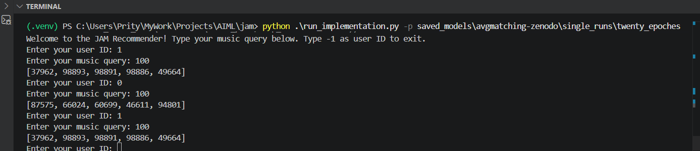

# Introduction
This repository is forked from: https://github.com/hcai-mms/jam

It reproduces the research paper:
**Just Ask for Music (JAM): Multimodal and Personalized Natural Language Music Recommendation**  
https://arxiv.org/pdf/2507.15826

## Citation
```bibtex
@inproceedings{melchiorre2025jam,
  title     = {Just Ask for Music (JAM): Multimodal and Personalized Natural Language Music Recommendation},
  author    = {Alessandro B. Melchiorre and Elena V. Epure and Shahed Masoudian and Gustavo Escobedo and Anna Hausberger and Manuel Moussallam and Markus Schedl},
  booktitle = {Proceedings of the 19th ACM Conference on Recommender Systems (RecSys)},
  year      = {2025},
  address   = {Prague, Czhech Republic},
  note      = {Short Paper},
  publisher = {ACM},
}
```

## Overview
This project focuses on implementing and understanding the JAM architecture, which learns joint representations of queries, users, and items for improved recommendation performance.

## My Contributions
- Reproduced the JAM model locally from the research paper 
- Understood the query-item matching mechanism 
- Used Virtual Environment instead for dependency management
- Set up training and evaluation pipeline 
- Added scripts to fetch, preprocess, split training data with `python run_preprocess.py` 
- Used the trained model to generate song recommendations for user queries with `python run_implementation.py -p <path_to_model_folder>`

## Output
The model generates personalized recommendations based on user ID and query.
Different users receive similar items but in different ranking orders, indicating user-specific preference modeling.
<div align="center">
    
</div>


## Key Learnings

- Importance of joint query-user-item embeddings in recommendation systems
- Effect of preprocessing (e.g., casing) on embedding-based models
- Difference between candidate generation and personalized ranking

## Installation & Setup

### Environment

- Python used `3.10.20`
- Install the environment with `python -m venv .venv`
- Activate the environment on windows with `.venv/Scripts/Activate.ps1`
- Install all dependencies with `pip install -r requirements.txt`

### Logging

- JAM uses [W&B](https://wandb.ai/site) for logging. You should create an account there first
- Modify the `constants/wandb_constants.py` file with your `entity_name` and `project_name`
- First time usage you might want call `wandb login` from the shell.


## Usage
General flow is
1. Create a configuration file
2. Run `python run_preprocess.py`

This will take care of :
- fetch data from zenodo
- preprocess data 
- split data to train, test and val

3. Run `python run_experiment.py -a avgmatching -d zenodo -c conf/confs/test_conf.yml`

The framework will take care of:
- Loading the data
- Training/Validating (optionally Testing) the model
- Saving the best model and configuration
- Log results to W&B

4. Run `python run_implementation.py -p <path_to_model_folder>`

### Running a Single Experiment
A single experiments can be 1) `train/val` + `test` 2) `train/val` 3) just `test`

1. Create a `.yml` config file (possibly in `conf/confs/`). See `conf/confs/template_conf.yml` for explanations of the possible values. See `constants/conf_constants.py` for defaults.
   1. Minimally, you should specify `data_path`, where `data/<dataset_name>` is looked for.
   2. Additionally, you should also add hyperparameters of your chosen algorithm.
   3. Running `test` as experiment type requires `model_path` to the saved model.
2. `python run_experiments.py -a <alg> -d <dataset> -c <path_to_conf> -t <run_type>`
   1. For `alg` and `dataset` see the available ones in `constants/enums.py`
   2. `path_to_conf` is what you specified above
   3. For `run_type` and other variables see `run_experiments.py`
3. Look at how your experiment is doing on W&B.

Example:
`test_conf.yml`
```yml
data_path: "./data"
d: 28 # for avgmatching model
device: cuda

n_epochs: 50
eval_batch_size: 256
train_batch_size: 256

running_settings:
  train_n_workers: 4
  eval_n_workers: 4
  batch_verbose: True
```
then run
`python run_experiment.py -a avgmatching -d zenodo -c conf/confs/test_conf.yml`
``
(if `-t` is not specified, it will run `train/val/test`)

### Codebase Structure
```
.
├── algorithms                  <- Classes about Query-User-Item Matching
├── conf                        <- Parsing & Storing .yml conf file
├── constants                   <- Constants & Enums used across the codebase
├── data                        <- Data classes, Raw and Processed Datasets
├── evaluation                  <- Metrics and Evaluation Procedure
├── train                       <- Trainer class
├── utilities                   <- Utilities from mild to low importance
├── (saved_models)              <- Automatically created (if def. conf is not altered)
├── experiment_helper.py        <- Executes the main functionalities of the code.
├── sweep_agent.py              <- Same as experiment_helper but for train_val and when launching sweeps.
├── run_preprocess.py           <- Fetch, pre-process and split training data.
├── run_implementation.py       <- Use trained model to generate playlist for user.
└── run_experiment.py           <- Entry point to the code.
├── run_test_sweep.py           <- Same as experiment_helper but for test results over a sweep.
```

# Original Repository Documentation ([Reference](https://github.com/hcai-mms/jam/blob/master/README.md))